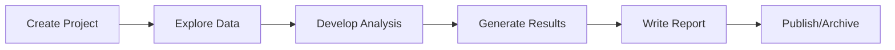

# FGV Clima Research Projects

This directory contains all research projects developed at FGV Clima. Each project is self-contained with its own documentation, code, and results.

## Active Projects

| Project | Description | Lead | Status |
|---------|-------------|------|--------|
| [2024-annual-climate-report](./2024-annual-climate-report/) | Annual climate indicators report for Brazil | - | In Progress |
| [2024-deforestation-paper](./2024-deforestation-paper/) | Analysis of deforestation drivers in the Amazon | - | In Progress |

## Completed Projects

| Project | Description | Lead | Publication |
|---------|-------------|------|-------------|
| - | - | - | - |

## Creating a New Project

### Option 1: Use the creation script (recommended)

```bash
python scripts/create_new_project.py "YYYY-project-name"
```

### Option 2: Copy the template manually

```bash
cp -r templates/project-template projects/YYYY-my-project
```

Then update the README.md with your project details.

## Project Naming Convention

Projects should follow this naming pattern:

```
YYYY-short-description
```

Examples:
- `2024-annual-climate-report`
- `2024-amazon-deforestation-drivers`
- `2025-cerrado-fire-analysis`

## Project Structure

Each project should follow this standard structure:

```
YYYY-project-name/
├── README.md           # Project documentation (required)
├── notebooks/          # Exploratory analysis
│   └── *.ipynb
├── src/                # Project-specific code
│   └── *.py / *.R
├── results/            # Outputs
│   ├── figures/
│   └── tables/
└── reports/            # Final documents
    └── *.pdf / *.docx
```

## Key Principles

1. **Data Access**: Reference data from `data-hub/` using relative paths
   ```python
   data_path = "../../data-hub/land-use/mapbiomas/"
   ```

2. **Shared Code**: Import common functions from `lib/`
   ```python
   from lib.loaders import load_mapbiomas
   from lib.viz import set_fgv_theme
   ```

3. **Documentation**: Every project must have a README with:
   - Research objectives
   - Data sources used
   - How to reproduce results
   - Key findings

4. **Reproducibility**: Results should be reproducible by running the project code

## Project Workflow



## Questions?

- Check the [main README](../README.md) for general documentation
- See [CONTRIBUTING.md](../CONTRIBUTING.md) for collaboration guidelines
- Open an issue for questions or suggestions
